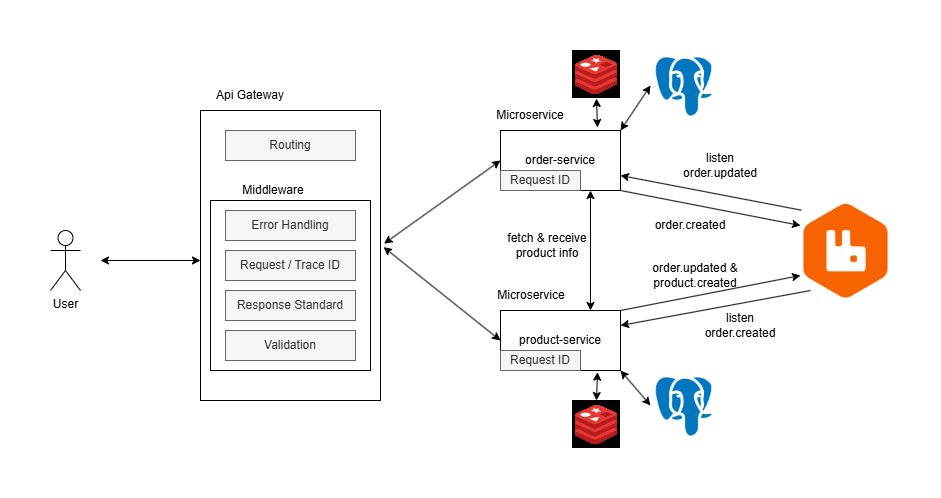

# Microservices Product & Order System

## Run Locally with Docker

1. Make .env from .env.example in each folder services
2. Build and Start All Services
```bash
docker-compose up --build
```

This will start all microservices and dependencies:
- PostgreSQL (each for products & orders)
- Redis (each for products & orders)
- RabbitMQ (message broker)
- Product Service
- Order Service
- k6 (load testing)

---

## API Request
Go to `docs/` folder and get / import `Product Order.postman_collection.json` into `Postman`
or
Go to
```
https://documenter.getpostman.com/view/9425838/2sB3WnxMs8
```
---

## Access Redis Containers
Make request first to fill the data needed (Create and Get)
### Product Redis
```bash
docker exec -it product-redis redis-cli
```
```bash
GET "product:1"
```
### Order Redis
```bash
docker exec -it order-redis redis-cli
```
```bash
GET "orders:product:1"
```

---

## Access RabbitMQ Dashboard

RabbitMQ Management UI: [http://localhost:15672](http://localhost:15672)  
**Username:** `guest`  
**Password:** `guest`

---
## Testing
### order service 
in folder order-service
```
go test ./internal/service/order_service_test.go -v
```
### product service & api gateway
in folder product-service and api-gateway
```
npm run test
```

---

## Load Testing with k6

The load test script is located in:
```
k6-tests/script.js
```
This test sends load to: POST http://order-service:3002/orders

How to Run 
```
.\test-load.ps1
```
or 
```
docker compose exec k6 k6 run /scripts/script.js
```

### Example Test Output

```
  █ THRESHOLDS
    errors
    ✗ 'count<1000' count=1794
    http_req_duration
    ✓ 'p(95)<1000' p(95)=23.66ms
    http_req_failed
    ✓ 'rate<0.05' rate=0.00%
    latency_ms
    ✓ 'p(95)<1000' p(95)=23.663825

  █ TOTAL RESULTS
    checks_total.......: 164834 1176.908139/s
    checks_succeeded...: 98.91% 163040 out of 164834
    checks_failed......: 1.08%  1794 out of 164834

    ✓ status is 200
    ✗ duration < 1s
      ↳  97% — ✓ 80623 / ✗ 1794

    CUSTOM
    errors.........................: 1794  12.809088/s
    latency_ms.....................: avg=257.251492 min=1.914971 med=3.996582 max=46675.317678 p(90)=10.918569 p(95)=23.663825

    HTTP
    http_req_duration..............: avg=257.25ms   min=1.91ms   med=3.99ms   max=46.67s       p(90)=10.91ms   p(95)=23.66ms
      { expected_response:true }...: avg=257.25ms   min=1.91ms   med=3.99ms   max=46.67s       p(90)=10.91ms   p(95)=23.66ms
    http_req_failed................: 0.00% 0 out of 82417
    http_reqs......................: 82417 588.45407/s
```
Based on http_reqs, RPS (Requests per second) is 588

# Architecture Explanation

`product-service` (NestJS) and `order-service` (Go) communicate asynchronously through **RabbitMQ**, and each maintains its own **PostgreSQL** database and **Redis** for frequently requested data.



## API Gateway & Middleware  
All client requests first pass through the **API Gateway**, which acts as a unified entry point to the system. It handles routing requests to the correct service and includes several **middleware layers**:

- **Validation Middleware** – ensures incoming requests contain valid data before reaching the services.  
- **Request/Trace ID Middleware** – attaches a unique trace ID to every request for distributed logging and debugging across services.  
- **Response Standardization Middleware** – unifies API response format from different services.  
- **Error Handling Middleware** – catches and formats service or network errors into consistent API responses.  

## Data Flow and Event Communication  
1. **Creating an Order**  
   - The user sends a `POST /orders` request through the API Gateway.  
   - The `order-service` validates the product by calling `product-service` or retrieving it from Redis.  
   - Once validated, it saves the new order in PostgreSQL and emits an **`order.created`** event to RabbitMQ.  

2. **Product Service Reaction**  
   - The `product-service` listens for the `order.created` event.  
   - When received, it reduces the product’s stock (`qty`) and updates its database and Redis cache.  
   - After successfully updated product, it emits an **`order.updated`** event to RabbitMQ to signal that the order can be marked as done.  

3. **Order Service Reaction**  
   - The `order-service` listens for the `order.updated` event.  
   - Upon receiving it, the order status is updated to `done` in the order database, and the cache is refreshed if necessary.  
